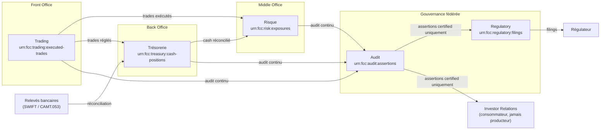
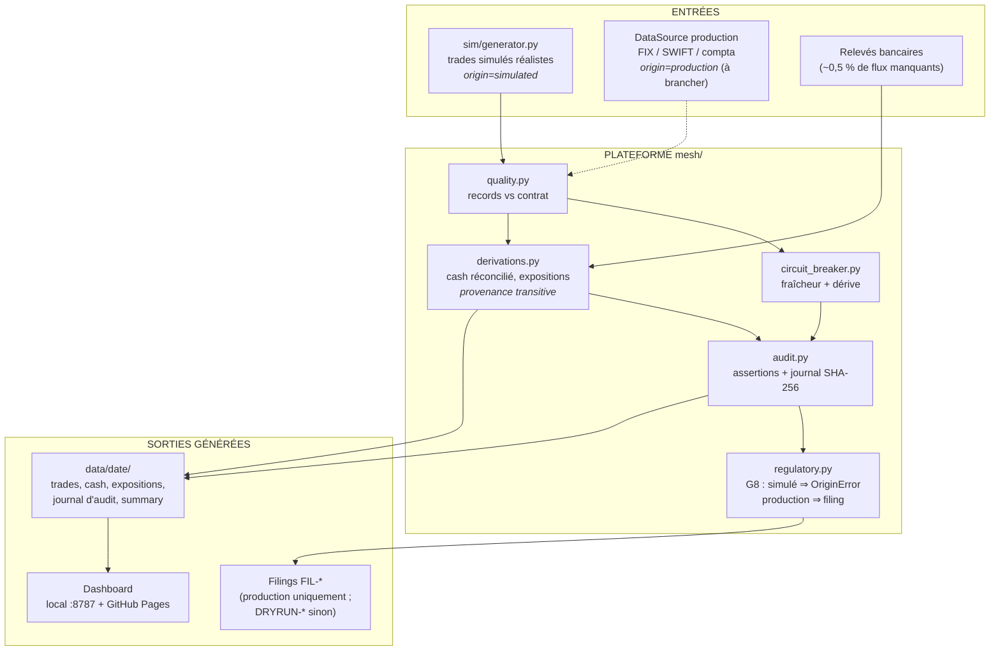
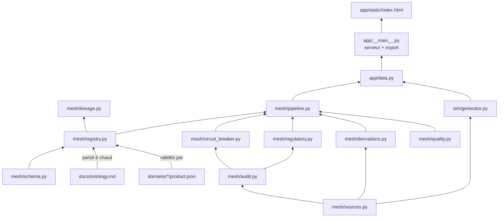

# Financial Command Center — Data Mesh Edition

Système de pilotage du cycle de vie financier d'une banque, organisé en
**Data Mesh** : chaque domaine métier (Trading, Trésorerie, Risque, Audit,
Regulatory) possède et publie son **Data Product**, sous une gouvernance
fédérée, une ontologie commune et un moteur de preuve d'audit immuable.

- **En local** : `python3 -m app` → http://localhost:8787 (zéro dépendance, Python 3 seul)
- **En ligne (gratuit)** : dashboard + explorateur exportés en site statique et
  publiés automatiquement par GitHub Pages à chaque push sur `main`
- **Explorateur de données** : les Data Products filtrables sans SQL (recherche,
  filtres par colonne, tri, pagination, export CSV) ou en SQL DuckDB — en local
  via l'API, en ligne via DuckDB-WASM dans le navigateur

---

## 1. Démarrage rapide

```bash
python3 -m unittest discover -s tests -v   # tests du noyau (38+)
python3 -m mesh catalog                    # catalogue des Data Products
python3 -m mesh validate                   # valide contrats + ontologie
python3 -m mesh simulate 2026-07-09        # rejoue un jour ouvré complet → data/
python3 -m app                             # dashboard + explorateur sur :8787
python3 -m app export                      # site statique autonome → dist/
```

L'explorateur SQL requiert la seule dépendance optionnelle du projet :
`pip install duckdb`. Sans elle, dashboard et mesh fonctionnent normalement.

## 2. Architecture d'ensemble

Chaque domaine est **propriétaire** de sa donnée (règle : le domaine qui peut
corriger une donnée à la source en est le propriétaire). Les produits
s'échangent via des contrats versionnés, jamais par accès direct.



Détails, décisions et roadmap : [`docs/architecture.md`](docs/architecture.md).

## 3. Squelette du dépôt

```
docs/                      Documentation d'architecture (source des pages Notion)
  architecture.md            Frontières de domaines, catalogue, roadmap
  ontology.md                Ontologie fédérée — source de vérité parsée par le code
  governance.md              Règles G1–G10, vérifiables par code uniquement
  connectivity.md            MCP, connecteurs, reporting certifié, feedback loop
  regulatory-mapping.md      Rapport ↔ régulateur/norme (AnaCredit, EMIR, MiFID II...)
mesh/                      PLATEFORME SELF-SERVICE (Python stdlib, zéro dépendance)
  contracts/
    data-product.schema.json Contrat type d'un Data Product
  schema.py                  Validateur JSON Schema minimal
  registry.py                Catalogue : découverte + validation (G1, G2, G7)
  audit.py                   Journal chaîné SHA-256 + assertions (G3, G4)
  circuit_breaker.py         Isolation d'un produit en dérive (G5)
  lineage.py                 Preuve XAI des sorties IA (G6)
  sources.py                 Frontière simulé/réel : provenance des batches (G8)
  quality.py                 Validation des records → signal du disjoncteur
  derivations.py             Trésorerie + Risque dérivés des trades (fonctions pures)
  regulatory.py              Publication bloquée hors production (G8)
  pipeline.py                Journée ouvrée de bout en bout
  warehouse.py               Entrepôt Parquet + SQL lecture seule (DuckDB, optionnel)
  accounting.py              Grand livre en partie double + contrôle de bouclage
  iam.py                     Sécurité contextuelle par classification (G9)
  reconciliation.py          IA de matching scoré (suggestions, décision humaine)
  transformer.py             DataTransformer : ingestion CSV/API → ontologie, audit natif
  feedback.py                Boucle de feedback : corrections humaines → scores
  __main__.py                CLI : catalog | validate | simulate | backfill
domains/                   LES 5 DATA PRODUCTS (un contrat product.json chacun)
  trading/ treasury/ risk/ audit/ regulatory/
sim/                       SIMULATEUR — seul module du dépôt créant de la donnée
  generator.py               Trades bancaires réalistes + relevés imparfaits
connectors/                CONNECTIVITÉ (couche anti-corruption + MCP)
  base.py                    Pattern connecteur : externe → ontologie, validé
  fix_trading.py             Exemple : ExecutionReport FIX 4.4 → Trading
  mcp_server.py              Serveur MCP stdio — outils des domaines, IAM G9
reporting/                 LIVRABLES CERTIFIÉS (CSV/XLSX/PDF, stdlib pur)
  generator.py               Annexe de Preuve obligatoire (G10) : UTC, demandeur,
                             SHA-256, assertions ; génération chaînée à l'audit
  renderers.py               Un format = une fonction, même signature
templates/reporting/       Templates par département (regulatory, IR, treasury)
app/                       APPLICATION (locale + export en ligne)
  data.py                    Agrégations → payload du dashboard
  static/index.html          Dashboard autonome (clair/sombre, SVG natif)
  static/explorer.html       Explorateur : filtres sans SQL + éditeur SQL
  static/reports.html        Rapports certifiés : génération + preuve depuis le navigateur
  static/recon.html          Réconciliation IA : suggestions scorées, accepter/rejeter
  __main__.py                Serveur local :8787 | export statique → dist/
tests/                     Tests unitaires + bout en bout
.github/workflows/pages.yml  CI : tests puis publication GitHub Pages
data/                      Sorties d'exécution (gitignoré — jamais dans le dépôt)
```

## 4. Ontologie fédérée (résumé)

Le vocabulaire commun est défini dans [`docs/ontology.md`](docs/ontology.md) —
et ce fichier markdown est **parsé par le registre** : un contrat qui utilise
un terme absent de l'ontologie est rejeté au chargement (règle G2).

| Terme | Steward | En une phrase |
|---|---|---|
| `Transaction` / `Trade` | Trading | Mouvement économique immuable ; correction = contre-passation |
| `Instrument` | Trading | Actif identifié par ISIN (sinon `INT:` interne) |
| `Counterparty` | Risque | Entité juridique identifiée par LEI |
| `Position` / `Exposure` | Risque | Agrégats **dérivés**, jamais saisis — lineage obligatoire |
| `CashPosition` / `Settlement` | Trésorerie | Solde nostro réconcilié ou non ; dénouement d'un trade |
| `AuditAssertion` | Audit | Affirmation vérifiable, ancrée dans le journal chaîné |
| `RegulatoryRule` / `Filing` | Regulatory | Règle en code + rapport référençant ses assertions |

Invariants transverses : montant = `(amount, currency)` ISO 4217, horodatage
UTC ISO 8601, publication externe ⇒ assertion `certified`, dérivé ⇒ lineage.

## 5. Fonctionnement — le flux d'une journée

Entrées, transformations et sorties du pipeline (`mesh/pipeline.py`) :



## 6. Organisation des modules et interconnexions

Qui importe qui — les flèches sont les seules dépendances autorisées
(`sim/` et `app/` dépendent de `mesh/`, jamais l'inverse) :



| Module | Entrée | Sortie |
|---|---|---|
| `sim/generator.py` | seed + date | batch de trades + relevés (`origin=simulated`) |
| `mesh/quality.py` | batch + contrat | records valides / violations (signal disjoncteur) |
| `mesh/derivations.py` | trades + relevés | cash positions réconciliées, expositions EUR |
| `mesh/audit.py` | événements + assertions | journal chaîné SHA-256, `proof_hash` |
| `mesh/regulatory.py` | assertion `certified` | filing `FIL-*` (prod) / `DRYRUN-*` / `OriginError` |
| `mesh/pipeline.py` | date + sources | `data/<date>/*.json` + résumé |
| `app/data.py` | date, seed, n_trades | payload d'agrégats prêt à tracer |
| `app/__main__.py` | payload | serveur local `:8787` **ou** `dist/index.html` statique |

## 7. Garantie simulé → réel (règle G8)

Le mesh tourne sur données simulées, mais la bascule vers le réel est
**structurelle** : `sim/` est le seul module créant de la donnée ; la
provenance est portée par chaque batch, **transitive** à travers les
dérivations, scellée dans les assertions d'audit, et `generate_filing()`
lève `OriginError` sur toute provenance non-production. Aucune donnée
n'entre dans le dépôt (`data/` gitignoré). Brancher le réel = implémenter
une `DataSource` avec `origin="production"` et l'injecter dans
`run_business_day()` — zéro autre changement, zéro reliquat possible.
Détails : [`docs/governance.md`](docs/governance.md) § 5.

## 8. Déploiement en ligne (gratuit)

`.github/workflows/pages.yml` : à chaque push sur `main`, la CI exécute les
tests, génère `dist/index.html` (dashboard autonome avec données embarquées,
marquées simulées) et le publie sur **GitHub Pages**. Une seule action
manuelle, une fois : *Settings → Pages → Source : GitHub Actions*.
